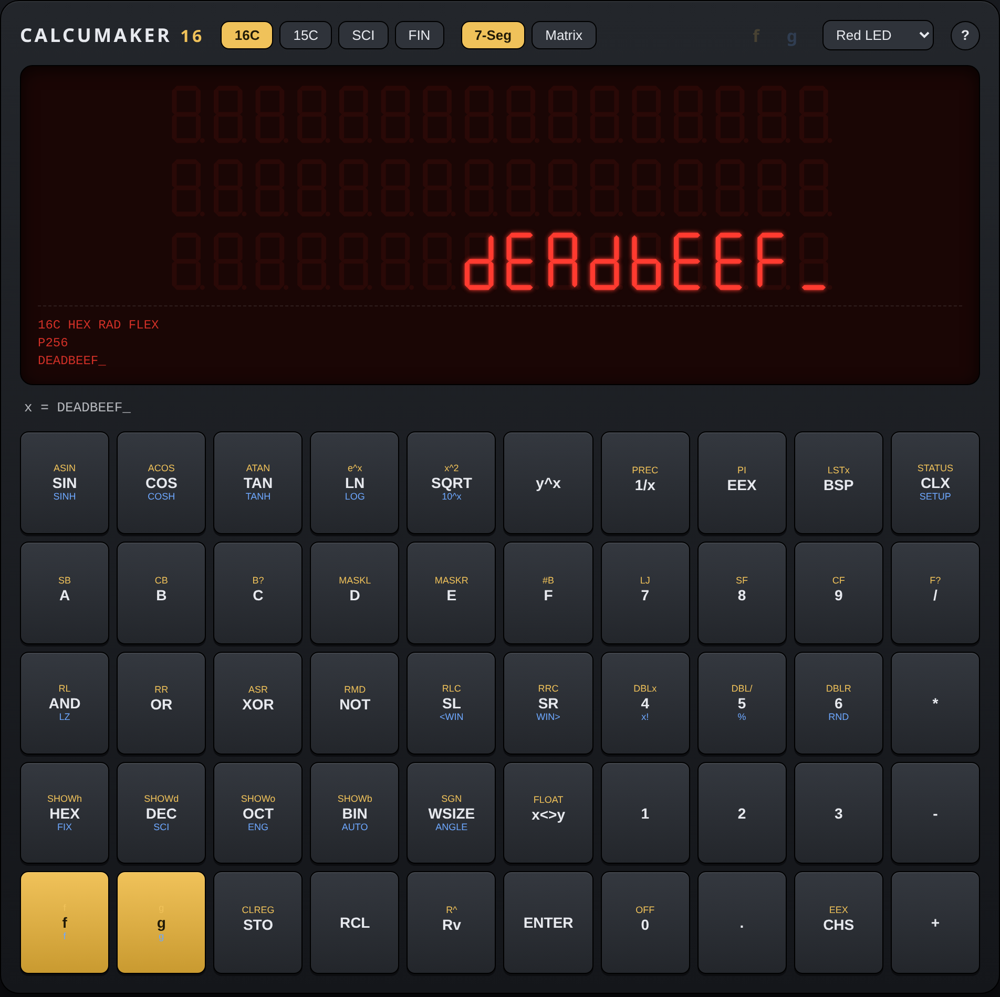
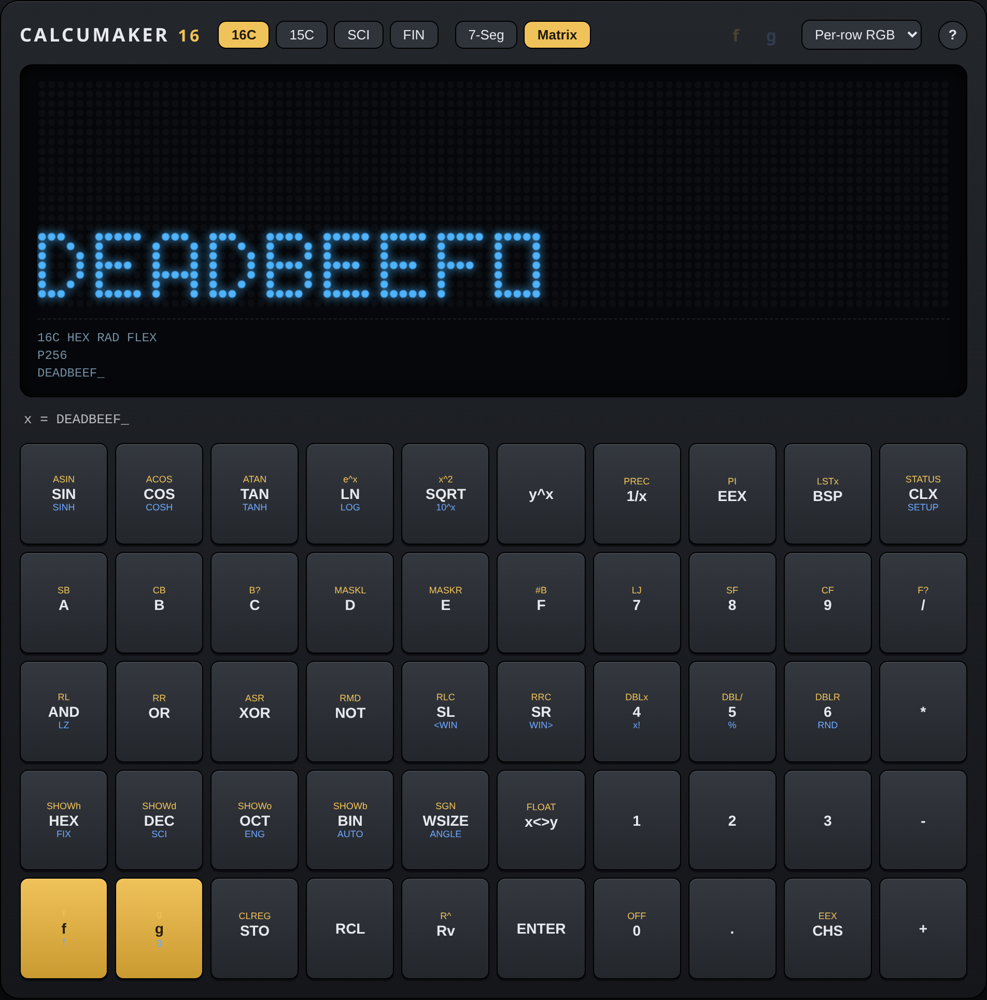

# Calcumaker Web

A **fully client-side** browser emulator of [Calcumaker 16](../calcumaker) —
running the *real* `calcumaker-core` engine (RPN + GNU MP + MPFR + MPC) compiled
to WebAssembly via **WASI**. Two interchangeable display modules mirror the
hardware: the multi-row **7-segment** display (SVG, LED / VFD / LCD skins) and
the **96×24 RGB dot-matrix** module (canvas, 5×7 font ported from the matrix
firmware).

It is a **thin I/O binding around `calcumaker-core`**, exactly like
`calcumaker-emu` — no calculator logic lives here. See **[PLAN.md](PLAN.md)** for
the architecture, milestones, and decisions.

| 7-segment module | RGB dot-matrix module |
|:---:|:---:|
|  |  |

*(Screenshots regenerated by `web/scripts/screenshots.mjs`.)*

## Build

```sh
# 1. Cross-build GMP + MPFR for wasm (once; needs WASI_SDK_PATH set)
WASI_SDK_PATH=/opt/wasi-sdk ./third_party/build-gmp-mpfr-wasi.sh

# 2. Build the engine to wasm and drop it into the web app
./scripts/build-wasm.sh

# 3. Run the frontend (dev server)
cd web && npm install && npm run dev
```

## Engine version

`calcumaker-wasm` builds the engine as a **path dependency** on the sibling
`../calcumaker` checkout, so nothing about the Cargo graph pins it. The pin lives
in **[`engine.lock`](engine.lock)** — one line, the engine commit SHA — and CI
builds *that* ref, never "whatever HEAD happens to be". A bundle is therefore
reproducible from the commit that produced it.

It updates itself, and needs **no secret to do so**:

1. **Pull (always on).** [`engine-watch.yml`](.github/workflows/engine-watch.yml)
   runs hourly, compares `engine.lock` with `calcumaker`'s HEAD, and when they
   differ dispatches `release-bundle` at that SHA. Dispatching a workflow in *our
   own* repo only needs the built-in `GITHUB_TOKEN`.
2. **Push (optional, instant).** `calcumaker`'s `notify-web.yml` can fire an
   `engine-updated` `repository_dispatch` the moment the engine moves. That is a
   *cross-repo* call, so it needs a PAT in a `WEB_DISPATCH_TOKEN` secret **on
   `calcumaker`**. Without it that job warns and skips — the hourly watcher still
   picks the change up.
3. Either way, this repo rebuilds against that SHA and runs every gate, and
   **only if they all pass** does CI commit the `engine.lock` bump and publish.
   A bad engine commit leaves the pin alone and goes red, naming the commit.

To add the instant path (from a machine that can mint a token):

```sh
# fine-grained PAT on calcumaker/calcumaker-web with Actions: read+write
gh secret set WEB_DISPATCH_TOKEN -R calcumaker/calcumaker
```

The bot's push uses `GITHUB_TOKEN`, which doesn't retrigger workflows, so it
can't loop. To adopt an engine commit by hand:

```sh
git -C ../calcumaker rev-parse HEAD > engine.lock
```

`scripts/build-wasm.sh` warns when your sibling checkout has drifted from the
pin, so a local build can't quietly disagree with what will ship.

## Lint & test

```sh
cd web && npm run lint          # ESLint (TS) + Stylelint (CSS); --max-warnings 0
cd web && npm run lint:fix      # auto-fix what's fixable
cargo fmt -p calcumaker-wasm -- --check
cargo clippy -p calcumaker-wasm --target wasm32-wasip1 -- -D warnings

node scripts/smoke.mjs                      # engine under Node WASI (GMP/MPFR)
cd web && npm run build && node scripts/verify-browser.mjs   # end-to-end in Chromium
```

CI runs all of these plus **actionlint** on the workflows. The browser suite
guards behaviour *and* layout: both display modules, all skins/palettes, the help
overlay + build versions, the colophon links, no horizontal overflow at 320/360/
390px, landscape keypad visibility, and `touch-action` (double-tap zoom off,
pinch-zoom on).

> The Rust lints are scoped to `-p calcumaker-wasm` on purpose: `--all` reaches
> through the path dependency into the sibling `calcumaker` repo, whose
> formatting isn't ours to gate.

## Ship a static build

The app is 100% client-side — no server, no runtime network. Produce the bundle
in one command (engine wasm + typecheck + Vite build):

```sh
./scripts/build-dist.sh          # -> web/dist/
```

`web/dist/` is self-contained (`index.html`, hashed `.js`/`.css`, and the
`.wasm`). Copy it to any static host. Preview it exactly as shipped:

```sh
cd web && npm run preview        # or: python3 -m http.server -d web/dist 8080
```

**Hosting requirements — minimal:**
- Serve `.wasm` as `Content-Type: application/wasm` (needed for streaming
  instantiation). GitHub/GitLab Pages, Netlify, Cloudflare Pages, Vercel, nginx,
  Caddy, and `vite preview` all do this out of the box.
- **No** cross-origin-isolation headers (COOP/COEP) required — the engine is
  single-threaded and uses no `SharedArrayBuffer`.
- Works from a subpath (e.g. project Pages at `/calcumaker-web/`): Vite `base` is
  `"./"`, so all asset URLs are relative. No SPA/rewrite rules needed — it's a
  single page.

To rebuild only after an engine (`calcumaker-core`) change, re-run
`./scripts/build-wasm.sh` then `(cd web && npm run build)`; `build-dist.sh` does
both.

## Publish to an external site

The dist tree is the deliverable — the question is just how you hand it over.

**Portable archive (host-agnostic).** Package a version-stamped bundle:

```sh
./scripts/package-dist.sh
# -> dist-artifacts/calcumaker-web-<sha>.{tar.gz,zip,sha256}
```

Extract and serve as-is anywhere, upload to a CDN/object store (S3, R2, GCS +
CDN), or attach to a GitHub Release (`gh release create v0.1.0
dist-artifacts/calcumaker-web-*.tar.gz`).

**Drag-and-drop hosts.** Point Netlify Drop or Cloudflare Pages "Direct Upload"
at `web/dist/` — no build config needed since the bundle is prebuilt.

**`gh-pages` branch.** Publish the tree to a branch a static host serves:

```sh
npx gh-pages -d web/dist            # or: git subtree / a worktree push
```

**GitHub Actions → release bundle (automated, wired up).**
[`.github/workflows/release-bundle.yml`](.github/workflows/release-bundle.yml)
builds + verifies the dist and publishes a **release bundle** a downstream
publisher pulls in — so building is decoupled from deploying. It checks out both
`calcumaker-web` and the sibling `calcumaker` (engine source for the path dep),
caches the wasi-sdk + the `vendor/wasi/` C cross-build, runs the Node smoke +
Playwright checks, then attaches to a release:

- **push to `main`** → rolling **`latest`** prerelease (stable download URL).
- **tag `v*`** → a permanent, versioned release to pin to.

Each release carries `calcumaker-web-dist.tar.gz`, `.zip`, `build-info.json`
(web + engine commit SHAs, build time), and `SHA256SUMS`.

> Setup notes: cross-repo checkout of a **private** `calcumaker/calcumaker` needs
> a PAT/deploy-key in the `CALCUMAKER_REPO_TOKEN` secret (public repos use the
> job token automatically). `workflow_dispatch` takes a `calcumaker_ref` input to
> build against a specific engine ref.

### Downstream publisher: pull the bundle

Another site/pipeline consumes the bundle from a stable location — no build
needed:

```sh
# newest main build (rolling), or swap `latest` for a version tag like v0.1.0
gh release download latest -R calcumaker/calcumaker-web \
  -p 'calcumaker-web-dist.tar.gz' -p 'SHA256SUMS'
sha256sum -c SHA256SUMS --ignore-missing
mkdir -p site && tar -C site -xzf calcumaker-web-dist.tar.gz
# `site/` is the servable tree (index.html + assets/) — deploy it as-is.
```

Or fetch the stable asset URL directly (CI without `gh`):
`https://github.com/calcumaker/calcumaker-web/releases/download/latest/calcumaker-web-dist.tar.gz`

**Self-hosted docroot.** [`scripts/deploy-release.sh`](scripts/deploy-release.sh)
productionizes that recipe for an nginx-style host: it pulls the release,
verifies the SHA256, extracts to `releases/<web_sha>-<core_sha>/`, and flips a
`current` symlink atomically (`rename`), keeping the last `$CALCUMAKER_WEB_KEEP`
for rollback. Idempotent (re-runs no-op), lock-guarded against overlapping
webhook/cron triggers. Point nginx `root` at `$CALCUMAKER_WEB_ROOT/current` and
run it from a webhook or cron; env vars (`CALCUMAKER_WEB_ROOT/REPO/TAG/KEEP`)
override the defaults.

**Hosting requirements are the same everywhere** — see the list above (serve
`.wasm` as `application/wasm`; no COOP/COEP; relative base).

## Stack

| Layer            | Choice                                             |
|------------------|----------------------------------------------------|
| Math → WASM      | GMP + MPFR + MPC cross-built with **wasi-sdk**, static |
| Engine           | `calcumaker-core` → `wasm32-wasip1` (path dep)     |
| Browser runtime  | `@bjorn3/browser_wasi_shim` (pure JS, no server)   |
| Display          | **SVG** 7-seg from real TM1640 bytes + CSS skins   |
| Frontend         | **Vanilla TypeScript + Vite**, Web Components      |

## License

Copyright © 2026 Yann Ramin.

[AGPL-3.0](LICENSE) (matches the firmware; compatible with LGPLv3 GMP/MPFR).
Because the AGPL covers network use, the deployed page carries a visible
**Source** link back to this repository (footer + help overlay), alongside the
exact `calcumaker-web` and engine commit SHAs it was built from.
